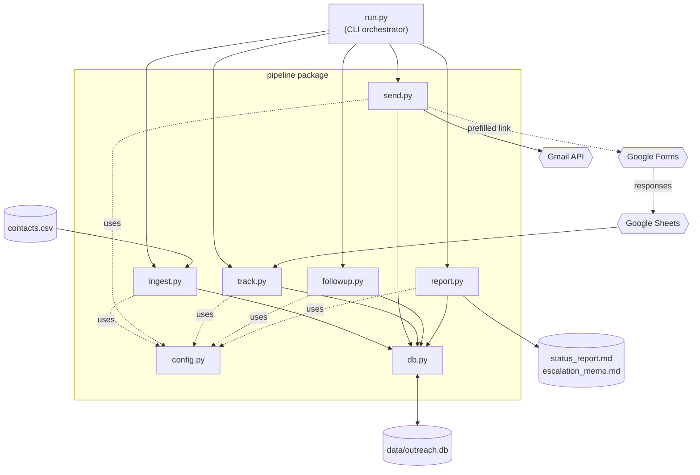
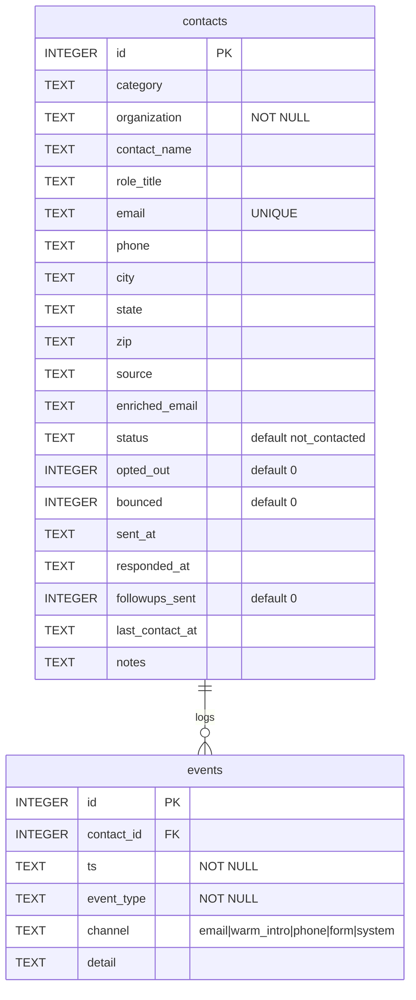
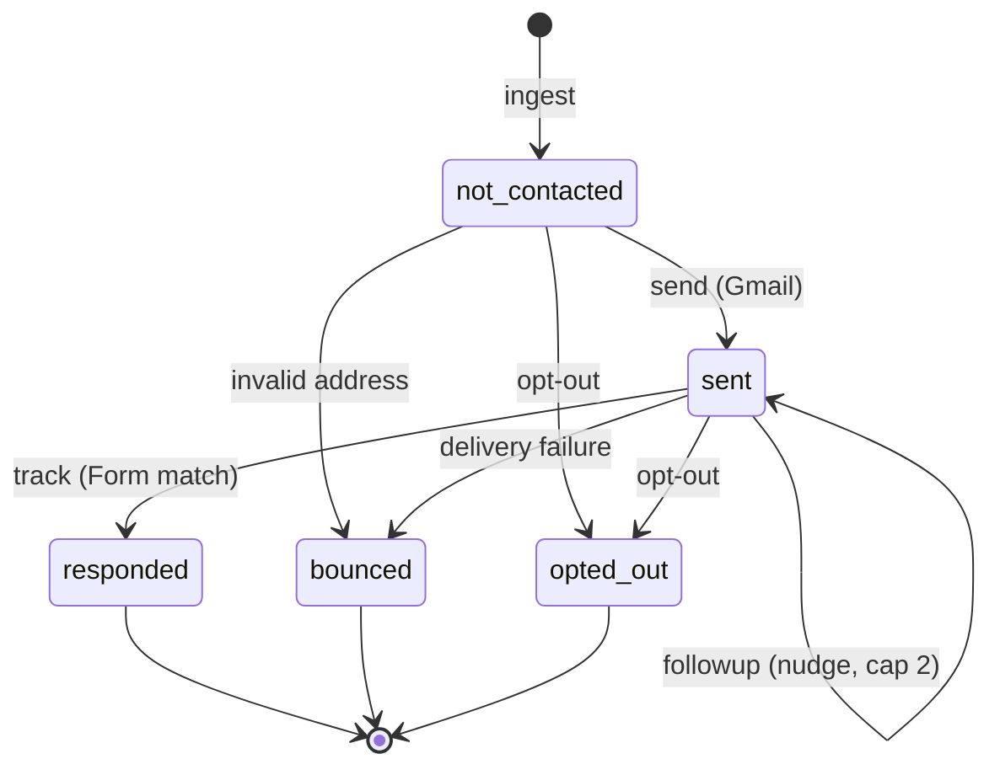
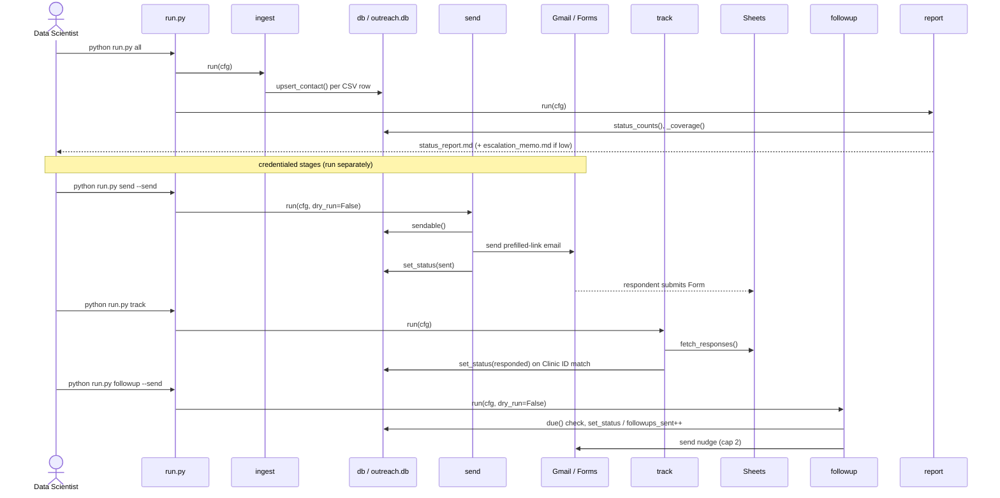

# Repository Structure — Reference for UML Diagrams

**Repo:** CS5934 — Application to Prevent Predictable Hospitalizations (Team 5)
**Purpose:** A structural distillation of the *current* repo so UML diagrams (component,
class/module, sequence, state, ERD) reflect what actually exists. Generated 2026-06-28.

> **Scope note:** Only `email_pipeline/` (US-003) contains executable code today. Everything
> else in the repo is planning/documents or a deployable survey script. Diagram the pipeline
> as the realized system; model the rest as *planned* components.

---

## 1. Top-level file tree (actual)

```
CS5934/
├── CLAUDE.md                                  # repo guidance
├── documents/                                 # planning artifacts (non-code)
│   ├── Product_Backlog.docx                   # 26 user stories
│   ├── Team 5 CS5934 Project Definition.docx  # Inception Report
│   ├── Va Tech Team Roadmap to Success.docx   # 7-phase roadmap
│   ├── va_rural_clinic_contacts.xlsx          # ~995-row contact list (US-002)
│   ├── rural_healthcare_needs_assessment_form_clean.gs  # survey builder (US-001, 838 lines)
│   ├── git-helper-sheet.md
│   ├── Sprint1_Submission.md                  # Sprint 1 report
│   └── Repo_Structure_for_UML.md              # (this file)
└── email_pipeline/                            # US-003 — the only code module
    ├── run.py                                 # CLI entrypoint
    ├── Makefile                               # convenience targets
    ├── requirements.txt                       # deps
    ├── config.example.yaml                    # config template
    ├── contacts.csv                           # curated send list (input)
    ├── .gitignore
    ├── README.md
    ├── pipeline/                              # package
    │   ├── __init__.py
    │   ├── config.py                          # config loader + DEFAULTS
    │   ├── db.py                              # SQLite schema + data access
    │   ├── ingest.py                          # stage 1
    │   ├── send.py                            # stage 2
    │   ├── track.py                           # stage 3
    │   ├── followup.py                        # stage 4
    │   └── report.py                          # stage 5
    └── data/                                  # generated (gitignored)
        ├── outreach.db                        # SQLite source of truth
        ├── status_report.md                   # report output
        └── escalation_memo.md                 # escalation output
```

---

## 2. Component diagram (email_pipeline)

Modules and their dependencies. `db.py` and `config.py` are the shared foundation; every
stage depends on both. `run.py` orchestrates the stages.



**External dependencies (from `requirements.txt`):** PyYAML, google-api-python-client,
google-auth-oauthlib, google-auth-httplib2, gspread. Core (ingest/db/report/run) uses only
the Python stdlib; only `send`/`track`/`followup` need Google credentials.

---

## 3. Module / "class" diagram (functions per module)

The codebase is module-functional (no Python classes). For a UML *class diagram*, model each
module as a class-like unit with its public functions as operations. Signatures are exact.


---

## 4. Data model / ERD (SQLite — `db.py`)

Two tables. `events` references `contacts` (append-only audit log). This is the source of
truth all stages read/write.



> Confirm exact column set against `email_pipeline/pipeline/db.py` lines 15–53 before
> publishing; fields above reflect the committed schema.

---

## 5. State machine (per-contact lifecycle — `db.STATUSES`)



`STATUSES = ("not_contacted", "sent", "responded", "bounced", "opted_out")`

---

## 6. Sequence diagram (`python run.py all` and full campaign)



---

## 7. Pipeline stage summary (for use-case / activity diagrams)

| Stage | Module | CLI command | Reads | Writes | Needs creds |
| --- | --- | --- | --- | --- | --- |
| Ingest | `ingest.py` | `run.py ingest` | `contacts.csv` | `contacts` table | No |
| Send | `send.py` | `run.py send [--send]` | `contacts` (sendable) | `contacts.status`, `events` | Gmail (live only) |
| Track | `track.py` | `run.py track` | Google Sheet responses | `contacts.status`, `events` | Sheets |
| Follow-up | `followup.py` | `run.py followup [--send]` | `contacts` (due) | `contacts.followups_sent`, `events` | Gmail (live only) |
| Report | `report.py` | `run.py report` | `contacts`, `events` | `status_report.md`, `escalation_memo.md` | No |
| All | `run.py` | `run.py all` | (ingest + report) | DB + reports | No |

---

## 8. Planned (not-yet-built) components — model as future

For a forward-looking architecture/component diagram, these are *planned* per the backlog
(Sprint 2–3) and have **no code yet**. Mark them distinctly (dashed / «planned»):

- **SDoH ingestion** (US-009) — pulls CDC PLACES / HRSA / Census / CMS (see data-source catalog US-006)
- **Synthetic clinical loader** (US-010) → clinical schema
- **Geographic join** (US-012) — county FIPS / ZCTA community→patient join (core challenge)
- **Feature engineering + bias screening** (US-013/014)
- **Modeling** (US-015–018) — logistic baseline, advanced models, PR-AUC + calibration, rurality fairness
- **Decision support** (US-019–022) — risk tiering (WHO), explainability (WHY), intervention mapping (WHAT NEXT), HITL override
- **Reproducible single-command pipeline** (US-023)

> These map to the use-case diagram in `Sprint1_Submission.md` §4 (UC3–UC12), which already
> distinguishes built (Sprint 1) vs planned (Sprint 2–3) use cases.
