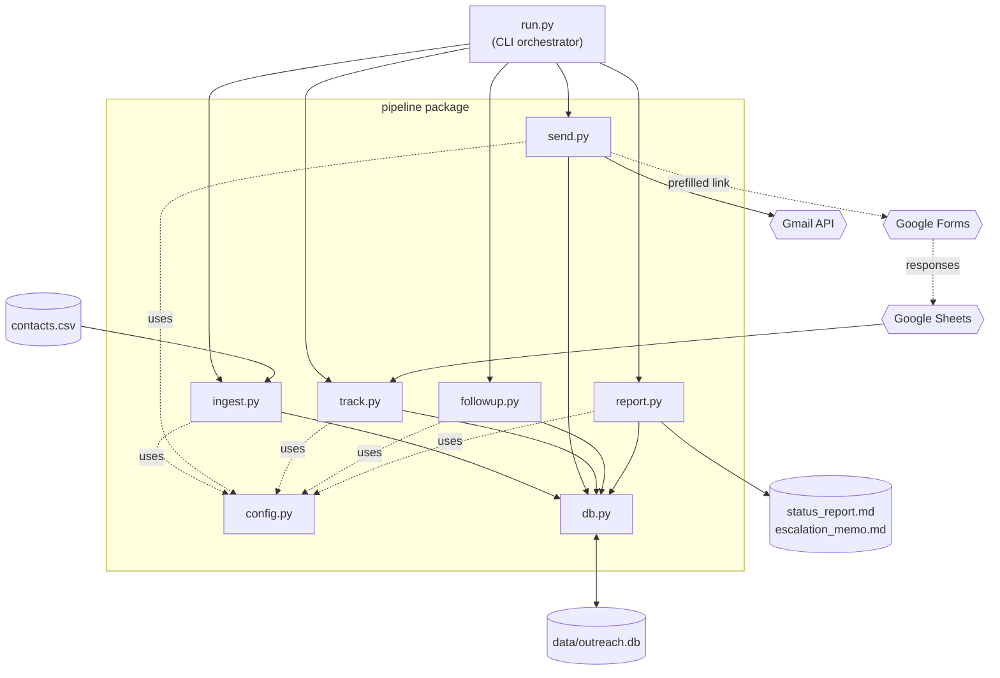
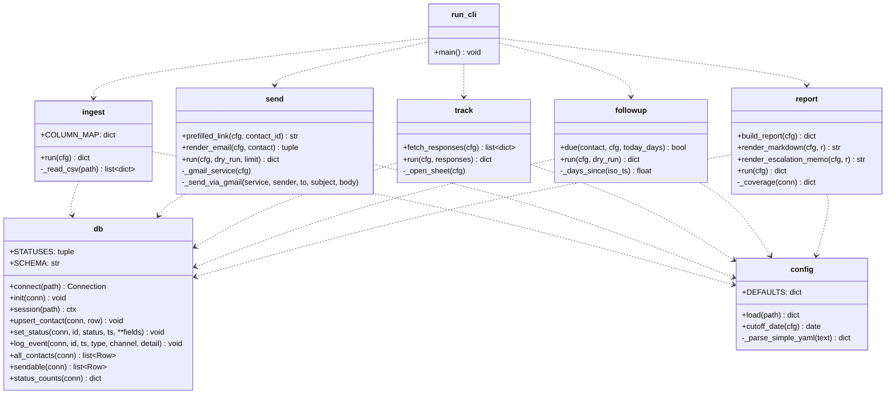
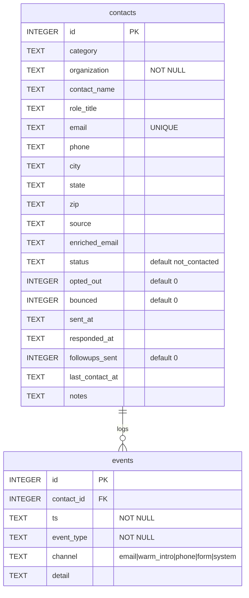
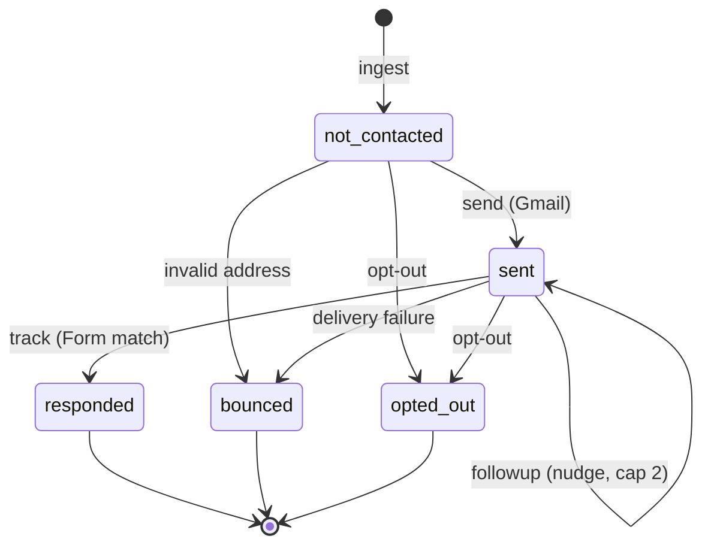
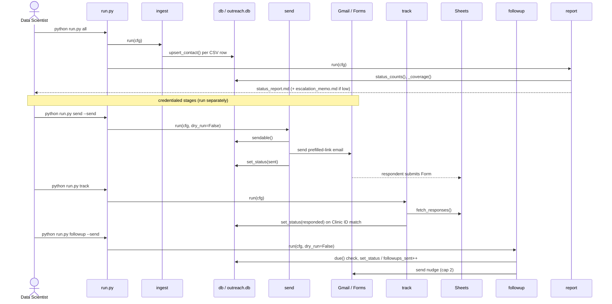

# Repository Structure: Reference for UML Diagrams

**Repo:** CS5934, Application to Prevent Predictable Hospitalizations (Team 5)
**Purpose:** a structural distillation of the repo so UML diagrams (component,
class/module, sequence, state, ERD) reflect what actually exists. Originally
generated 2026-06-28; scope note refreshed since.

> **Scope note:** when this was first written, `email_pipeline/` (US-003) was
> the only executable code, and sections 2-7 diagram it in full (they still
> match the code exactly). The repo has since grown the Clinic Needs Atlas
> platform: `src/` (ingestion, transforms, models, grants recommender, FastAPI
> API, Postgres access), `dashboard/`, `db/migrations/`, and a test suite. For
> the atlas architecture use
> [architecture-current-state.md](architecture-current-state.md) and
> [erd.md](erd.md); this file remains the reference for the email pipeline
> subsystem.

---

## 1. File tree

Current top level, abbreviated:

```
CS5934/
├── data_source_catalog/       # data source catalog (data_sources.yml, lineage, validator)
├── dashboard/                 # Signal dashboard (app.html, app/, ds/, data/)
├── db/migrations/             # Postgres schema (see erd.md)
├── documents/                 # planning artifacts + design docs (this folder)
├── email_pipeline/            # US-003 survey outreach tool (detailed below)
├── src/                       # atlas pipeline: ingestion, transform, model, grants, api, db
├── tests/                     # unit + API tests
├── scripts/                   # build/train/deploy helpers
└── render.yaml                # Render Blueprint (static site + API + Postgres)
```

The email pipeline, in full (the `data/` directory is created at runtime and
gitignored):

```
email_pipeline/
├── run.py                     # CLI entrypoint
├── Makefile                   # convenience targets
├── requirements.txt           # deps
├── config.example.yaml        # config template
├── contacts.csv               # curated send list (input)
├── .gitignore
├── README.md
├── pipeline/                  # package
│   ├── __init__.py
│   ├── config.py              # config loader + DEFAULTS
│   ├── db.py                  # SQLite schema + data access
│   ├── ingest.py              # stage 1
│   ├── send.py                # stage 2
│   ├── track.py               # stage 3
│   ├── followup.py            # stage 4
│   └── report.py              # stage 5
└── data/                      # generated (gitignored)
    ├── outreach.db            # SQLite source of truth
    ├── status_report.md       # report output
    └── escalation_memo.md     # escalation output
```

---

## 2. Component diagram (email_pipeline)

Modules and their dependencies. `db.py` and `config.py` are the shared
foundation; every stage depends on both. `run.py` orchestrates the stages.



**External dependencies (from `requirements.txt`):** PyYAML,
google-api-python-client, google-auth-oauthlib, google-auth-httplib2, gspread.
Core (ingest/db/report/run) uses only the Python stdlib; only
`send`/`track`/`followup` need Google credentials.

---

## 3. Module / "class" diagram (functions per module)

The codebase is module-functional (no Python classes). For a UML class
diagram, model each module as a class-like unit with its public functions as
operations. Signatures are exact.



---

## 4. Data model / ERD (SQLite, `db.py`)

Two tables. `events` references `contacts` (append-only audit log). This is
the source of truth all stages read and write. The column set below matches
the committed `SCHEMA` in `email_pipeline/pipeline/db.py`.



The atlas platform has its own, separate data model (Postgres): see
[erd.md](erd.md) and `db/migrations/`.

---

## 5. State machine (per-contact lifecycle, `db.STATUSES`)



`STATUSES = ("not_contacted", "sent", "responded", "bounced", "opted_out")`

---

## 6. Sequence diagram (`python run.py all` and full campaign)



---

## 7. Pipeline stage summary (for use-case / activity diagrams)

| Stage | Module | CLI command | Reads | Writes | Needs creds |
| --- | --- | --- | --- | --- | --- |
| Ingest | `ingest.py` | `run.py ingest` | `contacts.csv` | `contacts` table | No |
| Send | `send.py` | `run.py send [--send]` | `contacts` (sendable) | `contacts.status`, `events` | Gmail (live only) |
| Track | `track.py` | `run.py track` | Google Sheet responses | `contacts.status`, `events` | Sheets |
| Follow-up | `followup.py` | `run.py followup [--send]` | `contacts` (due) | `contacts.followups_sent`, `events` | Gmail (live only) |
| Report | `report.py` | `run.py report` | `contacts`, `events` | `status_report.md`, `escalation_memo.md` | No |
| All | `run.py` | `run.py all` | (ingest + report) | DB + reports | No |

---

## 8. Backlog items originally listed as "planned"

These were future work when this doc was written. Most have since landed;
diagram them as built, not «planned»:

- SDoH ingestion (US-009): built, `src/ingestion/` (CDC PLACES, HRSA HPSA, Census ACS/PEP, USDA, CDC EJI, VDH chronic disease, plus stubs).
- Synthetic clinical loader (US-010): built, `src/ingestion/synthetic_clinical.py`.
- Geographic join (US-012): built, `src/transform/geographic_join.py`; coverage audit in the build output.
- Feature engineering + bias screening (US-013/014): see `documents/us-014-feature-screening.md`.
- Modeling (US-015-018): built, `src/model/` (logistic baseline, training, scoring, fairness checks).
- Decision support (US-019-022): risk tiers and per-prediction drivers are in `src/model/score.py`; human-in-the-loop override remains open.
- Reproducible single-command pipeline (US-023): `scripts/run-pipeline.sh` and friends.

Newer additions with no counterpart in the original backlog list: the NNDSS
early-warning forecasts (`src/model/forecast*.py`), the grant funding
recommender (`src/grants/`), and the FastAPI backend (`src/api/`).
