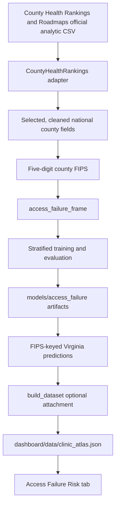

# Rural Care Access Failure: Technical Implementation

## Executive Summary

The Clinic Needs Atlas now includes a Rural Care Access Failure Model and an **Access Failure Risk** tab in the canonical live dashboard, [dashboard/clinic-needs-atlas-live.html](../dashboard/clinic-needs-atlas-live.html). The model estimates whether a county is likely to fall in the highest national quarter of observed preventable hospital stays using public access-barrier measures. It complements the existing Virginia need model and synthetic patient model; it does not replace either one.

The implementation adds one optional national source adapter, a separate model target, FIPS-keyed Virginia predictions, and a compact metadata object in the existing `clinic_atlas.json` build. The interface adds an accessible two-tab shell and a searchable, filterable, sortable county review table in a dedicated module, without changing the existing dashboard state, county selector, comparison behavior, or styling.

Intentionally out of scope: patient-level prediction, causal inference, new mapping dependencies, broad dashboard redesign, rurality fairness claims where the modeling frame lacks a rurality field, and a plot package solely for report figures.

## Relevant Architecture

The repository is catalog-driven. `data_source_catalog/config/data_sources.yml` describes sources and `field_lineage.json` records field transformations. `src/ingestion/registry.py` exposes source adapters. `src/build_dataset.py` runs standard dashboard sources, establishes the Virginia county spine, builds the existing record schema, stamps provenance, and writes `dashboard/data/clinic_atlas.json`.

Modeling lives under `src/model/`. `dataset.py` makes model-ready frames, and `train.py` evaluates candidate models and writes ignored, reproducible artifacts under `models/`. The live dashboard is a single static HTML page with an inline D3 bundle and its own JavaScript state; it fetches `dashboard/data/clinic_atlas.json` over HTTP. The README identifies it as the supported dashboard. `dashboard/clinic-needs-atlas.html` is documented as a frozen synthetic template and was not changed.

## End-to-End Data Flow



The normal atlas build deliberately excludes the national source because its adapter is marked `training_only`. The model command reads the national source directly. A later atlas build reads only the saved prediction, metrics, and model-card artifacts and joins predictions to the existing Virginia records by FIPS.

## File-by-File Change Log

| Path | Purpose and key change | Inputs / outputs | Coverage |
| --- | --- | --- | --- |
| `src/ingestion/county_health_rankings.py` | New official-source adapter; parses selected county analytic fields, normalizes FIPS, removes aggregate rows, preserves county equivalents, and logs cleaning coverage. | Official CSV or `COUNTY_HEALTH_RANKINGS_PATH` -> national cleaned frame. | `tests/test_county_health_rankings.py` |
| `src/ingestion/registry.py` | Registers the adapter without making it part of the regular dashboard source spine. | Catalog -> source registry. | Source and full-suite tests. |
| `src/model/config.py` | Defines the access-failure feature allowlist, target, national 75th-percentile threshold rule, version, tiers, and driver labels. | Configuration -> model and prediction serialization. | `tests/test_access_failure.py` |
| `src/model/dataset.py` | Builds the national leakage-safe feature frame and derives `broadband_gap`. | Clean source frame -> `X`, binary target, features, FIPS/source metadata. | `tests/test_access_failure.py` |
| `src/model/train.py` | Adds `--target access-failure`, imputation pipelines, candidate evaluation, artifact paths, predictions, model card, and display-tier metadata. | Frame -> joblib model, metrics, model card, predictions. | `tests/test_access_failure.py` |
| `src/build_dataset.py` | Excludes `training_only` sources from normal builds; attaches valid predictions by FIPS and emits optional `accessFailureModel` metadata from generated artifacts and the catalog. | Existing county records + artifacts -> unchanged records plus optional access-risk fields. | `tests/test_access_failure.py` |
| `data_source_catalog/config/data_sources.yml` | Adds the official source configuration, URL, refresh guidance, fields, limitations, and required/optional status. | Catalog metadata. | Catalog validation. |
| `data_source_catalog/config/field_lineage.json` and `.yml` | Adds lineage for source fields, target, engineered broadband gap, probabilities, tiers, drivers, and source year. | Catalog lineage metadata. | Catalog validation. |
| `data_source_catalog/docs/data_source_catalog.md` | Lists the new source in catalog documentation. | Documentation. | Catalog validation. |
| `pyproject.toml` | Adds the adapter to the ingestion independence contract. | Import-linter configuration. | `lint-imports`. |
| `README.md` | Documents purpose, source, features, artifacts, caveats, and build sequence. | Developer instructions. | Manual documentation audit. |
| `dashboard/clinic-needs-atlas-live.html` | Adds only tab navigation, tab panels, asset includes, and the additive data handoff. | `clinic_atlas.json` -> dedicated tab initialization. | `tests/test_access_failure_dashboard.py`, browser smoke tests. |
| `dashboard/access-failure-tab.js` and `dashboard/access-failure-tab.css` | Own all risk-tab state, events, rendering, and namespaced styles. | `clinic_atlas.json` -> rendered risk tab. | `tests/test_access_failure_dashboard.py`, browser smoke tests. |
| `tests/fixtures/county_health_rankings.csv` | Small official-schema-shaped offline fixture. | Fixture -> adapter tests. | `tests/test_county_health_rankings.py` |
| `tests/test_county_health_rankings.py` | Validates parsing, suppression, FIPS handling, aggregate removal, and deterministic deduplication. | Fixture -> adapter behavior. | Focused test. |
| `tests/test_access_failure.py` | Validates thresholding, leakage guard, attachment, malformed-score rejection, generated metadata, artifacts, and CLI. | Synthetic frame/artifacts -> model contract. | Focused test. |
| `tests/test_access_failure_dashboard.py` | Guards the canonical tab, controls, metadata hook, secure external-link attributes, and unavailable copy. | Live HTML -> static UI contract. | Focused test. |
| `documents/access_failure_implementation.md` | This implementation guide. | Code/artifacts -> onboarding reference. | Documentation audit. |
| `documents/access_failure_data_science_report.md` | Evidence-based modeling report. | Generated artifacts/source inspection -> report. | Documentation audit. |

## Source Configuration and Operations

The source is **County Health Rankings & Roadmaps National County Analytic Data**, configured in the catalog as the [2025 Annual Data Release supplemental analytic CSV dated March 25, 2026](https://www.countyhealthrankings.org/sites/default/files/media/document/analytic_supplement_20260325%5B1%5D.csv). The adapter downloads the catalog `access_url` with a 120-second timeout and caches the raw file under `data/raw/`; that directory is ignored by Git. Use the environment variable below to run from an already downloaded official CSV, including in offline testing:

```powershell
$env:COUNTY_HEALTH_RANKINGS_PATH = 'C:\path\to\official-analytic.csv'
uv run python -m src.model.train --target access-failure
```

The override bypasses download/cache lookup and fails clearly when the path does not exist. The regular atlas build never fetches this source. A publisher schema refresh should recheck the catalog URL, `fipscode`, selected field codes, tests, and the documented release year before retraining.

## Dashboard Data Contract

Each matched county may receive an `accessFailureRisk` object. It contains `probability`, display-only `riskTier`, `predictedHighRisk`, `observedPreventableStays`, readable `topDrivers`, `explanationMethod`, `dataYear`, and `modelVersion`. The object is absent for an unscored county; absence is never converted to zero or Low risk.

When both `models/access_failure/metrics.json` and `model_card.json` are present, the build adds an optional top-level `accessFailureModel` object. It contains selected-model performance, split counts, threshold, feature list, display tiers, source identity and URLs from the catalog, and limitations. Existing dashboard consumers can ignore this additive object. Attachment rejects nonnumeric, nonfinite, out-of-range scores and invalid tiers.

The live tab derives its summary values from these objects. It exposes a table baseline with search, tier filter, four sort orders, tab-local county selection, selected-row styling, and visible unavailable states. The existing county dropdown is not read or changed. The external official-source and documentation links use `target="_blank"` and `rel="noopener noreferrer"`.

## Existing Feature Preservation

The first implementation put risk-tab CSS and interaction code into the original live page. The audit found that this altered the shared `selectClinic` flow, changed the existing provenance status labels, added risk provenance to the original strip, and included mobile selectors that changed the original layout. Those changes were reverted.

The final page keeps only the new navigation entry, two tab-panel IDs, the module and stylesheet includes, and an additive `init` payload handoff. `access-failure-tab.js` owns its own records, selected county, controls, events, and rendering. `access-failure-tab.css` uses only `access-failure-*` selectors. The model fields remain additive JSON data, but `accessFailureRisk` is deliberately excluded from the pre-existing provenance object. Static regression tests compare the original style block and core selection/render functions to `HEAD`, verify that the original panel contains no risk content, and ensure the dedicated module does not access original dashboard state.

## Run Instructions

From a clean checkout, use the repository's locked `uv` environment:

```bash
uv sync --extra model
uv run --env-file .env python src/build_dataset.py --refresh
uv run python -m src.model.train --target access-failure
uv run python src/build_dataset.py
uv run pytest -q
uv run python -m http.server 8000
```

Open [http://localhost:8000/dashboard/clinic-needs-atlas-live.html](http://localhost:8000/dashboard/clinic-needs-atlas-live.html), then select **Access Failure Risk**. The second build is required: model training writes `models/access_failure/predictions.json`, while the standard build is the step that merges those predictions and generated metadata into `dashboard/data/clinic_atlas.json`.

`--refresh` is appropriate when upstream data should be fetched again. It may need a valid `CENSUS_API_KEY` for all non-model SDoH panels; without it, the existing Census-backed domain fields remain documented stubs. Access-failure training itself uses the configured County Health Rankings source or the explicit local override.

## Testing and Validation

Focused checks cover offline parsing, FIPS handling, target construction, artifact generation, malformed-score rejection, JSON metadata construction, and the canonical dashboard markup. The current full suite passed with `40 passed`.

Manual smoke checks should confirm the existing comparative atlas opens unchanged from a hard refresh, then confirm the new tab renders a scored county, filtering updates its row count, sorting changes order, selecting a row updates only the tab-local detail panel, and an unscored county shows the explicit unavailable state. Confirm the methodology disclosure and official source link render without `undefined`, `NaN`, or stack traces. Check desktop and narrow widths for table scrolling rather than page-level horizontal overflow.

No report figures were generated because matplotlib was not installed in the available project environment; no plotting dependency was added solely for documentation.

## Troubleshooting

| Symptom | Likely cause and response |
| --- | --- |
| Access tab says predictions are unavailable | Run the model command, then the second dataset build. Verify `models/access_failure/predictions.json` exists. |
| Model training cannot obtain source data | Check network access or set `COUNTY_HEALTH_RANKINGS_PATH` to the official CSV. |
| Adapter reports missing columns | The publisher schema changed. Compare the source codebook and update field codes only after validation. |
| Fewer Virginia predictions than atlas counties | Counties can lack the observed target or required source data. The UI intentionally marks them unavailable. |
| Source URL fails | Use the catalog documentation URL to locate a current official release, update catalog metadata, then rerun tests and training. |
| Normal atlas build shows Census warning | Supply `CENSUS_API_KEY`; this is unrelated to the access-failure model. |
| Browser page falls back to synthetic data | Serve the repository over HTTP and open the documented live URL, not `file://`. |

## Known Limitations and Next Steps

The model is county-level, source-year-dependent, predictive rather than causal, and based on a Medicare fee-for-service utilization indicator. Its display tiers are communication thresholds, not clinical cutoffs. The target is defined with a full eligible-national-data percentile before the split, an explicit MVP choice that should be revisited with temporal validation. Public county measures can be suppressed or lagged, and geographic correlation is not modeled.

Useful next work includes annual schema monitoring, temporal or geographic validation, calibration assessment beyond a Brier score, facility-capacity features, locally reviewed planning workflows, carefully defined rurality analysis, grant-alignment comparisons, and a county geometry layer only if the existing product adopts a supported mapping approach.
