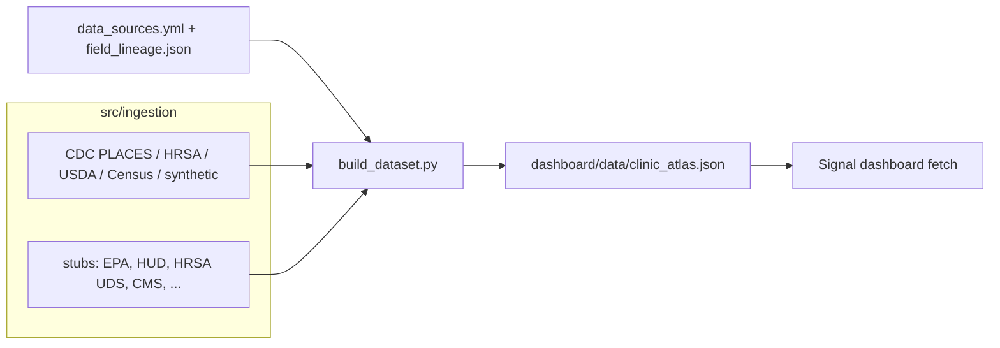

# Current-State Architecture

How the Clinic Needs Atlas works **today** (before the Phase 1 platform build).
The pipeline is a batch ETL; the dashboard is a static page. There is no
always-on server yet.

## Components
| Layer | Path | Role |
|---|---|---|
| Catalog | `data_source_catalog/config/` | Source of truth: `data_sources.yml` (17 sources) + `field_lineage.json` (field → source_id). |
| Catalog loader | `src/catalog.py` | The one reader of the catalog; used by ingestion, build, and the validator. |
| Ingestion | `src/ingestion/` | One class per source (`RealSource`/`StubSource`), each returns a `county_fips`-keyed frame. Registry in `registry.py`. |
| Transforms | `src/transform/` | Pure functions: `normalize_burden` (0–100), `need_index`. |
| Build | `src/build_dataset.py` | Runs sources → joins on `county_fips` → normalizes → writes `dashboard/data/clinic_atlas.json`. |
| Reference | `data/reference/va_county_region.csv` | 133 VA counties → real name + region + district. |
| Dashboard (frozen) | `dashboard/clinic-needs-atlas.html` | Synthetic template; design reference, do not edit. |
| Dashboard (Signal) | `dashboard/app.html` + `dashboard/app/` + `dashboard/ds/` | The app: one shell, hash-routed views (Overview / County / Worklist / Trends / Explore / Methods), shared county state, navy/gold tokens. |
| Dashboard (frozen reference) | `reference/clinic-needs-atlas.html`, `reference/clinic-needs-atlas-live.html` | Original dark D3 builds, kept for design reference; not deployed. |
| Email pipeline | `email_pipeline/` | Separate survey tool (US-003); SQLite state; unrelated to the atlas. |

## Data flow (today)

## Real vs. stub (why panels differ)
- **Live now:** CDC PLACES (outcomes), HRSA HPSA (care access), USDA (food), synthetic roster; Census ACS + population when `CENSUS_API_KEY` is set.
- **Stub (neutral 50, badged "pending"):** EPA EJSCREEN, HRSA UDS quality measures, HUD, and catalog-only sources (CMS, NWSS, NNDSS, grants, state feeds).
- Every emitted field carries `provenance` (`real`/`synthetic`/`stub`) so the dashboard badges it honestly.

## Deployment (today)
Render **Static Site** (`render.yaml`): build step runs `build_dataset.py` to
generate the JSON, publishes `dashboard/`. No server; data refreshes on deploy.
`CENSUS_API_KEY` is a Render secret. `clinic_atlas.json` and `data/raw/` are
git-ignored (regenerated at build).

## Guardrails
- Boundaries enforced by `import-linter` (`pyproject.toml`); see [architecture-boundaries.md](architecture-boundaries.md).
- Pure transforms unit-tested (`tests/test_transform.py`).
- Catalog validated by `data_source_catalog/scripts/validate_data_catalog.py`.

## What Phase 1 changes
The batch-ETL-to-JSON path becomes **scheduled ingestion → Render Postgres →
FastAPI API → dashboard**. See [erd.md](erd.md) for the target data model and
[roadmap-next-steps.md](roadmap-next-steps.md) for the plan.
