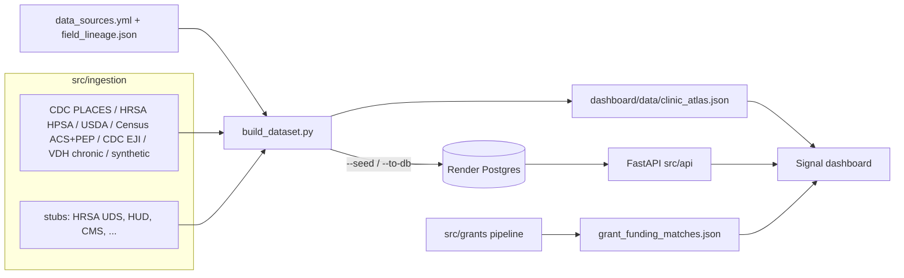

# Current-State Architecture

How the Clinic Needs Atlas works today. One codebase, two deployment modes:

- **Static:** the ETL runs at build time and writes JSON; the dashboard fetches
  those files. No server involved.
- **Live:** a FastAPI backend serves the same data from Render Postgres, plus
  auth, the chat assistant, and the forecast endpoints. The dashboard switches
  modes via `dashboard/config.js`, which the deploy script rewrites when an API
  host is configured.

## Components
| Layer | Path | Role |
|---|---|---|
| Catalog | `data_source_catalog/config/` | Source of truth: `data_sources.yml` (19 sources) + `field_lineage.json` (field to source_id). |
| Catalog loader | `src/catalog.py` | The one reader of the catalog; used by ingestion, build, and the validator. |
| Ingestion | `src/ingestion/` | One class per source (`RealSource`/`StubSource`), each returns a `county_fips`-keyed frame. Registry in `registry.py`. `cdc_nndss` is real but state-keyed, so it runs standalone (`python -m src.ingestion.cdc_nndss`) and feeds forecasting instead of the county merge. |
| Transforms | `src/transform/` | Pure functions: `normalize_burden` (0-100), `blend_domain`, `need_index`, and the geographic join. |
| Models | `src/model/` | Preventable-hospitalization risk models (train/score), NNDSS forecast pipeline, supply needs, threat ranking. |
| Build | `src/build_dataset.py` | Runs sources, joins on `county_fips`, normalizes, writes `dashboard/data/clinic_atlas.json`. `--seed` / `--to-db` load Postgres. |
| API | `src/api/` | FastAPI app (`main.py`) with atlas, auth, chat, and forecast routers. Falls back to the built JSON when `DATABASE_URL` is unset. |
| DB access | `src/db/` + `db/migrations/` | Engine, writers, queries; plain-SQL migrations applied with `python -m src.db.migrate`. |
| Grants | `src/grants/` | Grants.gov recommender pipeline; writes `dashboard/data/grant_funding_matches.json` for the Funding Matches tab. |
| Reference | `data/reference/` | `va_county_region.csv` (133 VA localities: name, region, district) and `va_county_rucc.csv` (locked USDA ERS RUCC 2023 rurality). |
| Dashboard | `dashboard/app.html` + `dashboard/app/` + `dashboard/ds/` | One shell, hash-routed views: Overview, Forest, County, Worklist, Trends, Explore, Methods, Funding Matches. Shared county state, navy/gold tokens, `index.html` landing page. |
| Frozen references | `reference/clinic-needs-atlas.html`, `reference/clinic-needs-atlas-live.html` | Original dark D3 builds, kept for design reference; not deployed. Standalone exports also sit in `dashboard/` (`clinic-needs-atlas-signal.html` and friends). |
| Email pipeline | `email_pipeline/` | Separate survey outreach tool (US-003); SQLite state; unrelated to the atlas. |

## Data flow

## Real vs. stub (why panels differ)
Live now: CDC PLACES outcomes (diabetes, obesity, mental distress, high BP,
depression, smoking), HRSA HPSA (care access + hpsaScore), USDA food access,
CDC EJI (environment domain), Census ACS SDoH + population estimates (need
`CENSUS_API_KEY`), Virginia Open Data chronic-disease hospitalizations, and the
synthetic patient roster. Rurality comes from a locked USDA ERS RUCC 2023
lookup, with a population-percentile fallback. CDC NNDSS is also real but
state-level only; it powers the early-warning forecasts, not county fields.

Still stubs (neutral 50, badged "pending"): HRSA UDS quality measures and HUD
housing, plus catalog-only placeholders (CMS x3, NWSS, a grants_gov stub, state
feeds, ASPR). Every emitted field carries `provenance` (`real` / `synthetic` /
`stub`) so the dashboard badges it honestly. Note the Grants.gov *recommender*
gets its data through `src/grants/client.py`, separately from the old
`grants_gov` stub source.

## Deployment
`render.yaml` is a Render Blueprint with three pieces:
- `clinic-needs-atlas` (static site): `scripts/build-site.sh` runs the ETL at
  deploy, publishes `dashboard/`, and writes `dashboard/config.js` to point at
  the API when `ATLAS_API_HOST` is set.
- `clinic-atlas-api` (Python web service): build step migrates, builds and
  seeds the dataset, ingests NNDSS, trains the risk models, and scores into
  Postgres; then serves `uvicorn src.api.main:app` with `/api/health` as the
  health check.
- `clinic-atlas-db`: Render Postgres, reached only through the API.

Secrets: `CENSUS_API_KEY`, `ANTHROPIC_API_KEY` (chat), `JWT_SECRET` (auth).
`data/raw/` and `data/processed/` are git-ignored and regenerated.
`dashboard/data/clinic_atlas.json` is listed in `.gitignore` but a built copy is
currently committed, so the static demo renders without running the pipeline.

## Guardrails
- Boundaries enforced by `import-linter` (`pyproject.toml`); see [architecture-boundaries.md](architecture-boundaries.md).
- Unit and API tests under `tests/` (transforms, geographic join, model, forecast, chat API, DB writer, grants, and more).
- Catalog validated by `data_source_catalog/scripts/validate_data_catalog.py`.
- CI (`.github/workflows/ci.yml`) runs the import contract and catalog validator on every PR.

## Where this stands against the phase plan
The Phase 1 target (ingestion to Postgres, FastAPI in front, dashboard reading
the API) is built. Data still refreshes at deploy time rather than on a cron
schedule. Auth (Phase 3) and the grounded chat assistant (Phase 4) exist in the
live mode. See [erd.md](erd.md) for the data model and
[roadmap-next-steps.md](roadmap-next-steps.md) for what's left.
