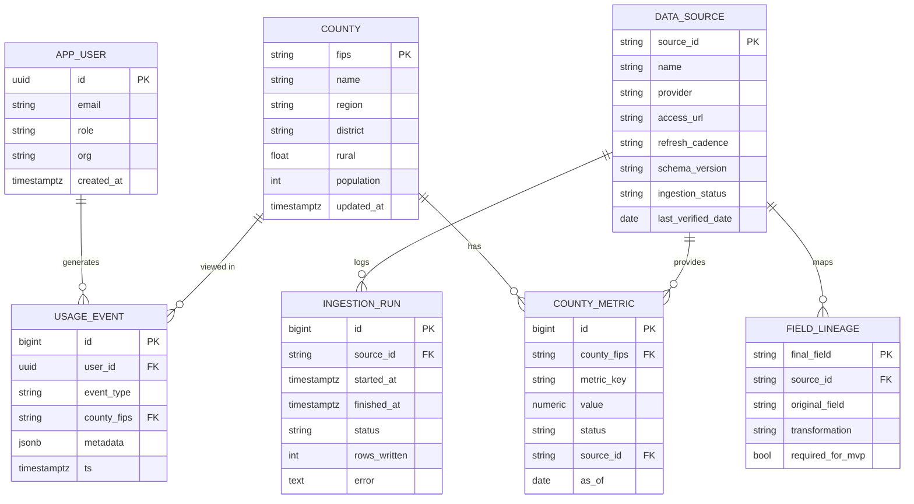

# Target Data Model (ERD)

The Postgres schema for the Phase 1 platform (FastAPI + Render Postgres).
Scheduled ingestion writes here; FastAPI reads from it and handles auth.

## Design choices (and why)
- **`COUNTY_METRIC` is a tall table** keyed by `metric_key` (e.g. `dom.economic`,
  `outcomes.diabetes`, `hpsa_score`) rather than one wide column per metric.
  Adding a new source/metric is an INSERT, not a schema migration — this is the
  anti-fragility win: new data can't break existing columns. Unique on
  `(county_fips, metric_key, as_of)`.
- **Provenance lives on each value** (`status`, `source_id`), so the API can badge
  real/synthetic/stub exactly as the current JSON does — every value traces to a
  catalog source.
- **The catalog is mirrored into the DB** (`DATA_SOURCE`, `FIELD_LINEAGE`) so the
  API and future admin views read it from one place; `data_sources.yml` stays the
  authoring source of truth and seeds these tables.
- **`INGESTION_RUN`** records each scheduled pull (source, timing, rows, errors) —
  observability for the "constantly pull and aggregate" requirement.
- **Auth** (Phase 3): app-managed accounts in `APP_USER` (FastAPI handles login +
  JWT sessions; no external provider). The DB is reached only through FastAPI, so
  access control lives in the API, not in the database. `USAGE_EVENT` captures
  tracking (page views, county selections) with a `user_id` FK.

## How data gets in
`src/ingestion/*` already returns `county_fips`-keyed frames. Phase 1 adds a thin
writer that upserts those into `COUNTY` + `COUNTY_METRIC` (with provenance) and
records an `INGESTION_RUN`, on a schedule (a Render cron job).
FastAPI exposes read endpoints (e.g. `/api/counties`, `/api/counties/{fips}`) that
the dashboard consumes instead of the static JSON.
