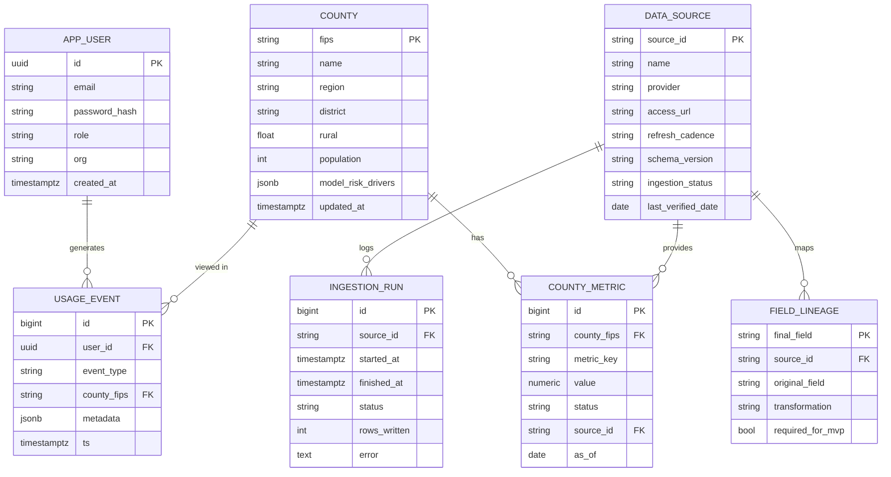

# Data Model (ERD)

The Postgres schema behind the live mode (FastAPI + Render Postgres).
Implemented in `db/migrations/0001_init.sql` and applied with
`uv run python -m src.db.migrate`. Ingestion writes here; FastAPI reads from it
and handles auth.

Later migrations add tables not shown above:
- `patient` (0003): scored synthetic patients per county and vintage, so the
  live API can serve the risk panel. Unique on `(county_fips, patient_key, as_of)`.
- `county.model_risk_drivers` (0004): the top SDoH factors pushing a county
  into the high tier, computed in `src/model/score.py`.
- `condition_forecast` and `county_condition_warning` (0005): state-level
  NNDSS forecasts and the county warnings allocated from them.
  `allocation_method` is NOT NULL on the county table by design; an allocated
  figure that can't say how it was derived must not exist.

## Design choices (and why)
- `COUNTY_METRIC` is a tall table keyed by `metric_key` (e.g. `dom.economic`,
  `outcomes.diabetes`, `hpsa_score`) rather than one wide column per metric.
  Adding a new source or metric is an INSERT, not a schema migration, so new
  data can't break existing columns. Unique on `(county_fips, metric_key, as_of)`.
- Provenance lives on each value (`status`, `source_id`). The API can badge
  real/synthetic/stub exactly as the JSON does, and every value traces to a
  catalog source.
- The catalog is mirrored into the DB (`DATA_SOURCE`, `FIELD_LINEAGE`) so the
  API and future admin views read it from one place. `data_sources.yml` stays
  the authoring source of truth and seeds these tables
  (`build_dataset.py --seed`).
- `INGESTION_RUN` records each pull (source, timing, rows, errors):
  observability for the "constantly pull and aggregate" requirement.
- Auth is app-managed accounts in `APP_USER`. FastAPI handles login and JWT
  sessions (`src/api/auth.py`, `src/api/security.py`); no external provider.
  The DB is reached only through FastAPI, so access control lives in the API,
  not in the database. `USAGE_EVENT` captures tracking (county views, chat
  questions) with a `user_id` FK.

## How data gets in
`src/ingestion/*` returns `county_fips`-keyed frames. `src/db/writer.py`
upserts them into `COUNTY` + `COUNTY_METRIC` with provenance and records an
`INGESTION_RUN`; `src/db/forecast_writer.py` does the same for forecasts. On
Render this runs in the API service's build step (`render.yaml`), so data
refreshes on deploy rather than on a cron schedule for now. FastAPI exposes
the read endpoints (`/api/counties`, `/api/counties/{fips}`, `/api/sources`)
that the dashboard consumes in live mode instead of the static JSON.
