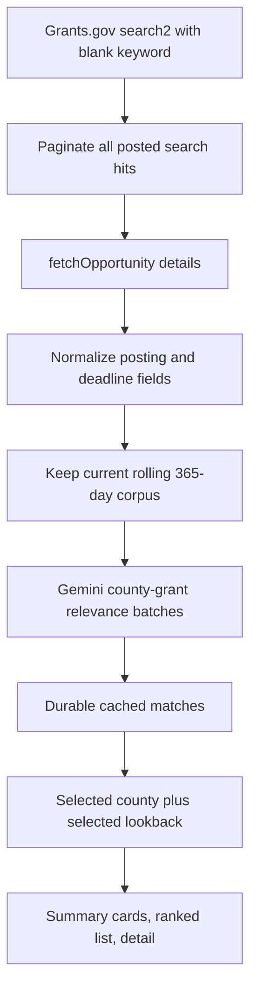

# Rural Clinic Funding Recommender Implementation

## Purpose

Funding Matches is an isolated `#/funding` decision-support view for rural clinic grant research. It combines public aggregate county planning indicators with public Grants.gov opportunities. It does not predict award success, determine legal eligibility, use patient data, or change another Atlas tab.

The canonical application shell intentionally has no global product-title label. The obsolete top-left title was removed without replacement; the header retains its navigation, county control, routing, and responsive behavior.

## Why the earlier page could show about two grants

The prior preview fixture contained five records, of which only two were posted, current, relevant, and not explicitly limited to another geography. In the production path, several independent caps could also reduce results: a fixed 60-record retrieval ceiling, a 20-opportunity county prefilter, a 10-recommendation serializer, and a 10-card UI slice. The generated static artifact still reflected the older TF-IDF implementation, while the new Gemini code path used a tiny fixture for local preview. This update removes those artificial retrieval, ranking, serialization, and display limits.

## Source corpus and dates


The public [Grants.gov API guide](https://www.grants.gov/api/api-guide) documents unauthenticated `POST /v1/api/search2` and `POST /v1/api/fetchOpportunity`. `search2` returns `oppHits`, `hitCount`, and `startRecordNum`; the client sends one blank-keyword query, requests every page, deduplicates opportunity IDs, and retrieves each detail record.

The normal corpus contains opportunities that are:

- `posted` by Grants.gov, not forecasts, archived, cancelled, or closed records;
- still accepting applications when a closing date is supplied (`closing_date >= today`);
- canonically posted within the rolling previous 365 days.

There is no source-level health, rural, agency, category, keyword, or Gemini filter. The retained Grants.gov fields do not provide a reliable normalized U.S.-applicability flag, so the client does not invent a text-based geography exclusion. Geography and organization eligibility remain visible downstream as planning screens. The canonical posting date is the detailed synopsis `postingDate`; normalized search-result `openDate` is used only when that detail field is absent. The API documentation does not define a posted-date request filter for this use, so the client applies the one-year and selected-window boundaries locally after complete pagination and detail normalization. A posted opportunity without a closing date remains visible as `Deadline not provided`.

The centralized lookback options are `7`, `14`, `30`, `90`, `180`, and `365` days. The default is 30 days, and every cutoff is inclusive: `posting_date >= today - lookback_days`.

## Retrieval and refresh flow



Raw and normalized data are stored separately under ignored `data/raw/grants_gov_opportunities/`. The Render daily job runs `python -m src.grants.pipeline --daily --refresh --persist`, updates the durable snapshot, and keeps last-known-good match output if Gemini has a transient failure. The API uses a compatible persisted Gemini snapshot when present; a legacy persisted snapshot yields to the checked-in current Gemini artifact. Changing the dashboard dropdown never calls Grants.gov.

## Gemini ranking and cache

`gemini-3.5-flash-lite` is used only from Python with server-side `GEMINI_API_KEY` and optional `GEMINI_MODEL`. The browser, static artifact configuration, and HTML never receive the key. The prompt includes only public county FIPS, county/region labels, rurality, HPSA/need context, activated planning tags, and limited public Grants.gov fields. It excludes patients, contacts, survey text, credentials, and raw API wrappers. Publisher text is explicitly delimited as untrusted data.

Gemini scores every active opportunity for each county against one fixed relevance rubric. Opportunities are split into configurable batches of 20; the backend validates that each response has one known, bounded, non-duplicate opportunity ID for every requested county-grant pair before decorating it with eligibility, deadline, tier, evidence, and readiness metadata. There is no TF-IDF, embedding, vector, cosine, nearest-neighbor, top-2, or top-5 path.

The artifact keeps hashes for each public opportunity content record and county profile. An existing pair score is reused only when the county profile hash, grant content hash, prompt version, and Gemini model match. This means a 7-day, 30-day, or 365-day view uses the same county-grant score and only filters the rolling corpus locally; new or changed grants are the pairs that need fresh scoring.

Eligibility is display metadata, not a broad corpus exclusion. `Likely compatible`, `Needs verification`, and `Likely incompatible` records remain browseable unless the grant is objectively unusable because it is no longer open or outside the rolling window. A named non-Virginia geography is shown as an eligibility warning rather than silently removed from the source corpus.

## Snapshot freshness and troubleshooting

The dashboard identifies a snapshot as needing refresh when it was produced by a legacy model contract or its source retrieval date is more than two days old. The page continues to show an explicit status message rather than presenting a legacy ranking as a current Gemini recommendation.

| Symptom | Layer | Diagnostic | Resolution |
| --- | --- | --- | --- |
| Blank Funding Matches page | Browser | Check the Babel console for a parse error | Repair the view syntax and reload the route. |
| Zero current county matches | Artifact/window | Compare `metadata.modelVersion`, `matchingMethod`, and `sourceRetrievedAt` with the selected lookback | Run the scheduled live refresh; do not replace production output with a fixture. |
| Gemini authentication failure | Server | Confirm the server-only `GEMINI_API_KEY` is configured | Add the key to the hosted API and cron service secret settings. |
| Gemini 429 or transient failure | Gemini/cache | Inspect refresh logs and `recommendationStatus` | Keep the last known good Gemini snapshot and retry on the next refresh. |
| Grants.gov failure | Source client | Inspect the public API request error | Retry with the bounded client and preserve the previous snapshot. |

## Artifact and interface

```text
metadata                              # source freshness and corpus bounds
opportunities[opportunityId]          # one normalized public record per grant
profiles[countyFips]                  # controlled public county profile
matchesByCounty[countyFips][]         # validated county-grant relevance rows
```

The Funding Matches page has two primary state dimensions: `selectedCounty` and `selectedLookbackDays`, plus filters and sorting. The selected grant detail is derived from the active rows and cleared whenever a county, window, filter, or sort transition could make it stale.

| Block | Scope | Lookback-sensitive calculation |
| --- | --- | --- |
| Available opportunities | Global | All open relevant corpus records in the selected window |
| County recommendations | County | Active county matches after window and active filters |
| Strong relevance | County | Active county matches with the Strong tier |
| Nearest deadline | County | Earliest non-expired deadline in the active county rows |
| Opportunity detail | County | Selected active match, otherwise the current first row |

The page offers the requested `Opportunity posted within` dropdown, agency/tier/deadline/eligibility/category filters, score/deadline/award sorting, and `Show more` pagination. It does not imply that only Strong relevance grants are the only available grants.

## Verification

Run offline deterministic checks without Gemini credentials:

```powershell
uv run python -m src.grants.pipeline --fixture tests/fixtures/grants_gov_opportunities.json
uv run pytest tests/test_grants_ingestion.py tests/test_grant_recommender.py tests/test_gemini_grants.py tests/test_funding_dashboard.py -q
```

Tests cover broad blank-keyword pagination and duplicate hits, posted/expired status handling, inclusive lookback boundaries, missing eligibility visibility, multi-batch complete ranking, pair-score reuse, last-known-good fallback after a Gemini failure, and a County A/B/C plus 7/14/30/90/180/365-day frontend state matrix. A source refresh must record actual API counts and Gemini calls rather than fabricate them. A 365-day code path does not mean a full 365-day live Gemini backfill was performed during a smoke test.

## Live-source and capacity audit (2026-08-11)

The August 11 controlled run predated the broad-corpus policy and used the former narrow retrieval strategy. Its counts must not be interpreted as the result of the current broad policy. The checked-in dashboard JSON is a current Gemini-ranked August 11 cached snapshot with 16 opportunities and 133 county profiles; it is deliberately preserved for review, static deployment, and no-key fallback. This change does not run a new Grants.gov pull or a new full Gemini backfill.

The configured code default and Render environment value are `gemini-3.5-flash-lite`; `GEMINI_MODEL` can override the code default. Gemini is called only by `GeminiRanker` through the official `google-genai` SDK method `client.models.generate_content` with JSON schema output. Authentication is explicit (`genai.Client(api_key=...)`) from the server-only `GEMINI_API_KEY` environment variable. The local audit runtime had no key and therefore made no Gemini call; the browser, static artifact, API response, and tracked documentation contain no key. Render expects the secret in both the API service and the daily cron service.

The full corpus is scored in batches of 8 county profiles by 20 grants. A score is reused across all six lookback windows when the county-profile hash, grant-content hash, prompt version, and model identity match. This avoids a county x grant x lookback multiplication. The following are measured character volumes from the live corpus, with token estimates using a conservative 4 characters/token approximation and fixture-response serialization as an output-size proxy; they are planning estimates, not billable Gemini usage.

| Scenario | Grants | Counties | Requests | Estimated input tokens | Output proxy tokens |
| --- | ---: | ---: | ---: | ---: | ---: |
| One county, 30 days | 51 | 1 | 3 | 50,206 | 3,320 |
| All Virginia localities, 30 days | 51 | 133 | 51 | 973,852 | 381,195 |
| One county, 365 days | 185 | 1 | 10 | 184,052 | 12,037 |
| All Virginia localities, 365 days | 185 | 133 | 170 | 3,530,058 | 1,382,120 |
| One changed grant, all localities | 1 | 133 | 17 | 62,571 | 8,602 |

The largest controllable cost is prompt size because current requests include public grant descriptions. Preserve recommendation quality while reducing quota consumption by applying a deterministic description budget, retaining title, synopsis, eligibility, categories, deadline, and the most relevant description passage; also cap rationale length. Do not weaken pair-score caching or rerank each lookback window. Exact RPM, TPM, RPD, active tier, live model resolution, and remaining quota require the owning Google AI Studio project because API limits are project-level and not exposed in this repository.

## Limitations

Gemini relevance is not award probability. Eligibility and geographic applicability require review against the official opportunity record. Grants.gov content can change after the daily refresh, and Gemini quota may constrain historical backfills. The future source corpus intentionally includes all current posted Grants.gov opportunities in the rolling 365-day window; the page's county-focused relevance and eligibility screens are planning support, not a source exclusion policy.
