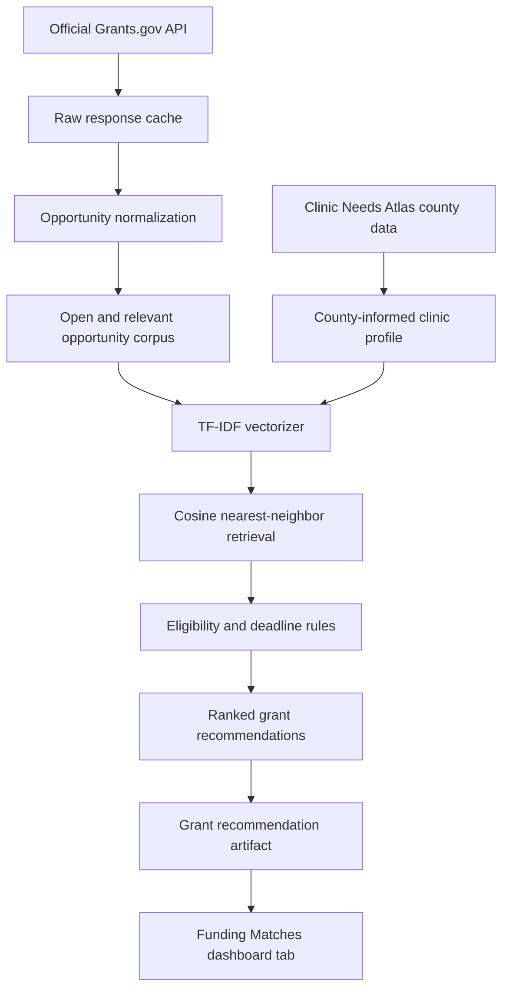

# Rural Clinic Grant Funding Recommender: implementation

## Executive summary

Funding Matches is an isolated decision-support capability for rural clinic planning. It ranks a deliberately small, current Grants.gov corpus against a deterministic county-informed clinic planning profile; it does not predict award success, clinical risk, or patient outcomes. The generated dashboard artifact contains shared opportunity details once and compact per-county match records, so the static dashboard stays available without a runtime API.

## User problem and Atlas integration

Rural clinic administrators need a defensible starting point for grant research: which opportunity may fit a community context, why it was surfaced, what is known about the deadline and award amount, and what still needs verification. The existing county Atlas remains unchanged. The feature is a separate `#/funding` route with one additive navigation entry and an optional `dashboard/data/grant_funding_matches.json` loader; an absent artifact only produces the new tab's empty state.

## Official source and API behavior

The source is the public [Grants.gov REST API guide](https://www.grants.gov/api/api-guide), verified on 2026-08-04. It documents unauthenticated `POST https://api.grants.gov/v1/api/search2` for opportunity search and `POST https://api.grants.gov/v1/api/fetchOpportunity` for one detailed record. The client pages `search2` with `rows` and `startRecordNum`, then requests detail with `{ "opportunityId": "…" }`.

The client searches a configurable rural-health planning vocabulary, retains HHS (including HRSA and CDC) plus USDA Rural Development subagencies, and limits the small corpus with `--max-results`. It sets a 25-second timeout, two bounded retries for transient errors, an identifying user agent, and records retrieval timestamps and official API URLs in the raw cache. One provenance caveat: when the raw cache is younger than 24 hours and `--refresh` is not passed, `retrieve()` returns the sentinel string `cache` as its retrieved-at value, and that literal string is what lands in the artifact's `sourceRetrievedAt` (fixture runs record `fixture`). Pass `--refresh` when you need a real source timestamp in the artifact. Raw response data and separately normalized records are cached under ignored `data/raw/grants_gov_opportunities/`; the raw cache deliberately excludes the API's transient response token.

## Extracted fields and normalization

| Official field(s) | Internal field | Cleaning | Use |
| --- | --- | --- | --- |
| `id`, `opportunityId` | `opportunity_id` | string, required, deduplicated | stable key and official URL |
| title/number/agency fields | title, opportunity number, agency | HTML and whitespace cleanup | list and detail views |
| synopsis or forecast description | synopsis, description | markup removal with paragraphs | TF-IDF corpus and explanation evidence |
| applicant types and eligibility narrative | applicant types, eligibility description | stable description lists; unknown remains unknown | compatibility screen |
| activity categories/instruments/ALNs | categories, instruments, listings | stable unique lists | corpus and filters |
| posting, response, archive dates | ISO dates | safe multi-format parsing | deadline status and sorting |
| award floor/ceiling/funding/count | numeric fields | currency and number parsing; unavailable stays `null` | planning information |
| cost sharing | boolean or unavailable | preserved | readiness prompt |

Normalization rejects a record without an ID or title, strips HTML, normalizes whitespace, parses dates and currency safely, preserves missing values, creates a stable `https://www.grants.gov/search-results-detail/{id}` link, validates the canonical fields, and deduplicates by ID. It reports raw, normalized, duplicate, status, missingness, agency, and category statistics before recommendation generation.

The 2026-08-04 live build retrieved 30 records, normalized all 30, found zero duplicates or rejections, and retained 18 active healthcare-relevant candidates after agency and clear-geography screens. Of the raw records, 11 were posted and 19 forecasted; six were already unsuitable by status/deadline. Missing eligibility was 16.7%, missing closing date 3.3%, and missing award range 43.3%; these are presented as unavailable rather than substituted values.

## County-informed planning profiles

`src/grants/profiles.py` creates one deterministic public-data profile for each Atlas locality. It reads only aggregate county fields (`rural`, `hpsaScore`, `needIndex`, Atlas domains, and published outcomes); it never reads synthetic patients, survey placeholders, PHI, or the ignored `accessFailureRisk` object. The text explicitly says it is a county-informed clinic planning profile, not a clinic's confirmed strategy.

Thresholds live in `src/grants/config.py`.

| Profile tag | Source field | Trigger | Meaning |
| --- | --- | --- | --- |
| rural healthcare delivery | `rural` | >= 0.5 | rurality context |
| primary care workforce shortage | `hpsaScore` | >= 14 | shortage-area planning context |
| behavioral-health access | `outcomes.mhlth` | >= 20 | elevated mental-distress context |
| mental health services | `outcomes.mhlth` | >= 23 | elevated-services mental-distress context |
| diabetes prevention and management | `outcomes.diabetes` | >= 11 | diabetes planning context |
| hypertension management | `outcomes.bphigh` | >= 34 | blood-pressure planning context |
| obesity prevention | `outcomes.obesity` | >= 35 | obesity planning context |
| food access | `dom.food` | >= 60 | food-access burden context |
| care coordination | `dom.access` | >= 60 | care-access burden context |
| community outreach | `dom.economic` | >= 65 | economic-barrier context |
| clinic infrastructure | `dom.environment` | >= 70 | environmental-burden infrastructure context |
| health equity / quality improvement | `needIndex` | >= 65 | elevated composite community need (two tags share this trigger) |

Each activated tag stores its field, observed value, exact threshold rule, and a plain-language explanation in the artifact.

## Content model and retrieval

The model is independent of the Atlas classifiers. `GrantRecommender` fits a `TfidfVectorizer` on title, agency, synopsis, description, categories, instruments, applicant types, and eligibility text, then fits `NearestNeighbors(metric="cosine", algorithm="brute")` on that matrix. The profile text is transformed in the same vocabulary and the nearest documents are retrieved by cosine distance.

The deployed parameters are lowercase text, English stop words, unigrams and bigrams, `min_df=1`, `max_df=1.0`, `max_features=2000`, and `sublinear_tf=True`. The 2026-08-04 corpus produced 2,000 TF-IDF features. Fitted vectorizer/index/ID ordering/parameters/source timestamp are saved under ignored `models/grant_recommender/`, keeping a production model binary out of Git.

## Eligibility, deadline, score, and explanations

The compatibility screen is deliberately restrained:

- `Likely incompatible` is a hard exclusion only for closed/past-deadline records, a clearly non-Virginia named geography, or applicant types limited to individuals.
- `Likely compatible` means the structured applicant types include an organization category commonly used by a clinic or partner; it is not a legal eligibility conclusion.
- `Needs verification` is the default when organization type or source language is ambiguous.

The score is a bounded relevance score, not a probability:

```text
match_score = clamp(
  0.75 * semantic_similarity
  + 0.10 * category_alignment
  + 0.10 * eligibility_compatibility
  + 0.05 * deadline_usability
)
```

Every component is retained from 0 to 1. Tiers are Strong relevance (>= 0.70), Moderate relevance (>= 0.45), and Limited relevance otherwise. In practice the committed 2026-08-04 artifact never leaves the bottom tier: all 1,330 stored matches are Limited relevance, with match scores between 0.12 and 0.29. The upper tiers are unreachable with the current TF-IDF cosine scoring because the short profile text overlaps only a little of each grant document's vocabulary, so treat the score as a within-county ordering rather than an absolute grade.

Up to four fit reasons are generated only from visible rural/health/category/deadline text and activated-profile tag evidence; a generic fallback reason keeps the list nonempty. Readiness prompts are practical checks (organization type, UEI/SAM.gov, eligibility narrative, scope, budget, partners, and cost sharing where listed), not claims that every item is legally required.

## Artifacts and dashboard

The generated JSON is normalized as follows:

```text
metadata
opportunities[opportunityId]     # full detail once
profiles[countyFips]             # controlled profile and tag evidence
matchesByCounty[countyFips][]    # IDs, scores, screens, reasons, checklists
```

This avoids duplicating full opportunity descriptions inside all 133 county records. The `Funding Matches` tab offers a tab-specific locality selector, summary metrics, filters (agency, tier, deadline, compatibility, category), sorting (score, deadline, award ceiling), cards, detail panel, methodology disclosure, source citation, responsive layout, and readable fallbacks for absent data. All new CSS is under `.funding-matches`.

## Flow



## Tests, commands, and troubleshooting

Run the normal project environment with:

```bash
uv sync --extra model
uv run python -m src.grants.pipeline --refresh --max-results 30
uv run pytest tests/test_grants_ingestion.py tests/test_grant_recommender.py tests/test_funding_dashboard.py -q
uv run python data_source_catalog/scripts/validate_data_catalog.py
uv run python -m http.server 8000
```

Offline/reproducible build:

```bash
uv run python -m src.grants.pipeline --fixture tests/fixtures/grants_gov_opportunities.json --output data/raw/grants_gov_opportunities/fixture_artifact.json
```

Keep the `--output` flag on fixture runs. The default output path is the committed `dashboard/data/grant_funding_matches.json`, so a fixture run without `--output` overwrites the 18-opportunity live artifact with the 5-record test fixture's output.

The focused tests cover parsing, HTML cleanup, currency/date handling, cache/fixture behavior, deduplication, closed/geographically incompatible exclusion, controlled profile thresholds, TF-IDF fitting, cosine ranking, score bounds, deterministic output, explanation/readiness fields, artifact serialization, tab registration, scoped styling, and existing-view isolation. If a live refresh fails, retain the last fresh raw cache or use the fixture to validate code; do not make `src/build_dataset.py` depend on Grants.gov. If the dashboard says the artifact is missing, run the grant pipeline separately and serve `dashboard/` over HTTP.

## Maintenance and limitations

Refresh on a planned cadence, review the selected vocabulary/agency scope, inspect source schema changes, and manually spot-check varied county results after each live refresh. No award-success model, ROC-AUC, PR-AUC, or accuracy is reported because there is no award label. Eligibility must be independently verified; the county profile is not a clinic strategy; opportunity details can change; the feature depends on a public source; and it processes no PHI.
