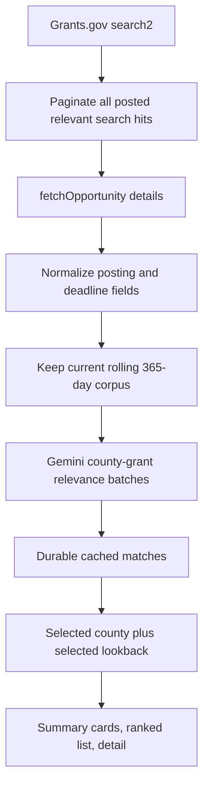

# Rural Clinic Funding Recommender Implementation

## Purpose

Funding Matches is an isolated `#/funding` decision-support view for rural clinic grant research. It combines public aggregate county planning indicators with public Grants.gov opportunities. It does not predict award success, determine legal eligibility, use patient data, or change another Atlas tab.

## Why the earlier page could show about two grants

The prior preview fixture contained five records, of which only two were posted, current, relevant, and not explicitly limited to another geography. In the production path, several independent caps could also reduce results: a fixed 60-record retrieval ceiling, a 20-opportunity county prefilter, a 10-recommendation serializer, and a 10-card UI slice. The generated static artifact still reflected the older TF-IDF implementation, while the new Gemini code path used a tiny fixture for local preview. This update removes those artificial retrieval, ranking, serialization, and display limits.

## Source corpus and dates

The public [Grants.gov API guide](https://www.grants.gov/api/api-guide) documents unauthenticated `POST /v1/api/search2` and `POST /v1/api/fetchOpportunity`. `search2` returns `oppHits`, `hitCount`, and `startRecordNum`; the client requests every page for each configured rural-health search term, deduplicates opportunity IDs, and retrieves each detail record.

The normal corpus contains opportunities that are:

- `posted` by Grants.gov, not forecasts, archived, cancelled, or closed records;
- still accepting applications when a closing date is supplied (`closing_date >= today`);
- relevant to the configured rural-health, community-development, food/nutrition, workforce, or regional-development scope; and
- canonically posted within the rolling previous 365 days.

The canonical posting date is the detailed synopsis `postingDate`; normalized search-result `openDate` is used only when that detail field is absent. The API documentation does not define a posted-date request filter for this use, so the client applies the one-year and selected-window boundaries locally after complete pagination and detail normalization. A posted opportunity without a closing date remains visible as `Deadline not provided`.

The centralized lookback options are `7`, `14`, `30`, `90`, `180`, and `365` days. The default is 30 days, and every cutoff is inclusive: `posting_date >= today - lookback_days`.

## Retrieval and refresh flow



Raw and normalized data are stored separately under ignored `data/raw/grants_gov_opportunities/`. The Render daily job runs `python -m src.grants.pipeline --daily --refresh --persist`, updates the durable snapshot, and keeps last-known-good match output if Gemini has a transient failure. Changing the dashboard dropdown never calls Grants.gov.

## Gemini ranking and cache

`gemini-3.5-flash-lite` is used only from Python with server-side `GEMINI_API_KEY` and optional `GEMINI_MODEL`. The browser, static artifact configuration, and HTML never receive the key. The prompt includes only public county FIPS, county/region labels, rurality, HPSA/need context, activated planning tags, and limited public Grants.gov fields. It excludes patients, contacts, survey text, credentials, and raw API wrappers. Publisher text is explicitly delimited as untrusted data.

Gemini scores every active opportunity for each county against one fixed relevance rubric. Opportunities are split into configurable batches of 20; the backend validates that each response has one known, bounded, non-duplicate opportunity ID for every requested county-grant pair before decorating it with eligibility, deadline, tier, evidence, and readiness metadata. There is no TF-IDF, embedding, vector, cosine, nearest-neighbor, top-2, or top-5 path.

The artifact keeps hashes for each public opportunity content record and county profile. An existing pair score is reused only when the county profile hash, grant content hash, prompt version, and Gemini model match. This means a 7-day, 30-day, or 365-day view uses the same county-grant score and only filters the rolling corpus locally; new or changed grants are the pairs that need fresh scoring.

Eligibility is display metadata, not a broad corpus exclusion. `Likely compatible`, `Needs verification`, and `Likely incompatible` records remain browseable unless the grant is objectively unusable because it is no longer open, outside the rolling window/scope, or explicitly restricted to a geography that excludes Virginia.

## Artifact and interface

```text
metadata                              # source freshness and corpus bounds
opportunities[opportunityId]          # one normalized public record per grant
profiles[countyFips]                  # controlled public county profile
matchesByCounty[countyFips][]         # validated county-grant relevance rows
```

The Funding Matches page has two primary state dimensions: `selectedCounty` and `selectedLookbackDays`, plus filters and sorting. The selected grant detail is derived from the active rows and cleared whenever a county, window, filter, or sort transition could make it stale.

| Block | Scope | Lookback-sensitive calculation |
| --- | --- | --- |
| Available opportunities | Global | All open relevant corpus records in the selected window |
| County recommendations | County | Active county matches after window and active filters |
| Strong relevance | County | Active county matches with the Strong tier |
| Nearest deadline | County | Earliest non-expired deadline in the active county rows |
| Opportunity detail | County | Selected active match, otherwise the current first row |

The page offers the requested `Opportunity posted within` dropdown, agency/tier/deadline/eligibility/category filters, score/deadline/award sorting, and `Show more` pagination. It does not imply that only Strong relevance grants are the only available grants.

## Verification

Run offline deterministic checks without Gemini credentials:

```powershell
uv run python -m src.grants.pipeline --fixture tests/fixtures/grants_gov_opportunities.json
uv run pytest tests/test_grants_ingestion.py tests/test_grant_recommender.py tests/test_gemini_grants.py tests/test_funding_dashboard.py -q
```

Tests cover full pagination and duplicate hits, posted/expired status handling, inclusive lookback boundaries, missing eligibility visibility, multi-batch complete ranking, pair-score reuse, and a County A/B/C plus 7/14/30/90/180/365-day frontend state matrix. The live verification procedure uses a 30-day source query and a small controlled number of counties only; it must record actual API counts and Gemini calls rather than fabricate them. A 365-day code path does not mean a full 365-day live Gemini backfill was performed during a smoke test.

## Limitations

Gemini relevance is not award probability. Eligibility and geographic applicability require review against the official opportunity record. Grants.gov content can change after the daily refresh, and Gemini quota may constrain historical backfills. The source scope is intentionally limited to credible rural-health and adjacent community/workforce funding, not every federal opportunity.
